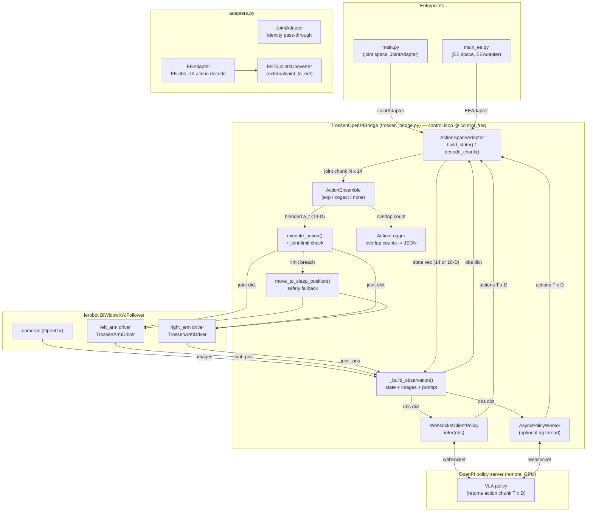
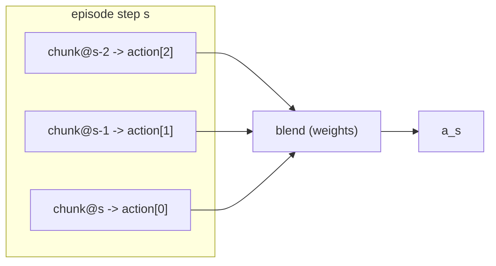
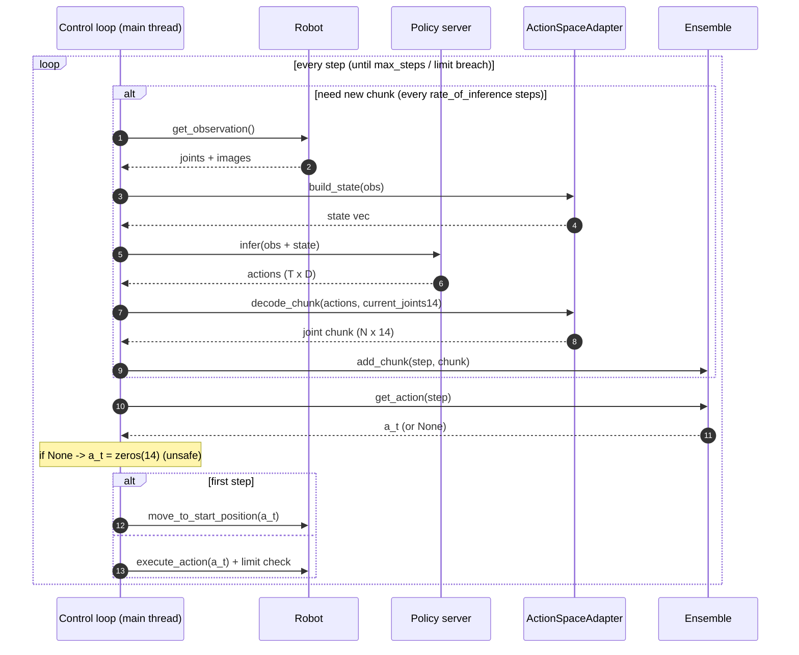
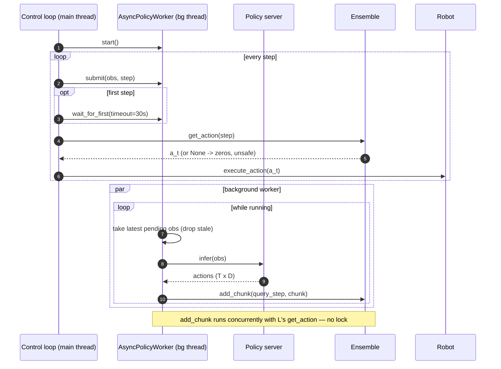

# Trossen OpenPI Eval Bridge — Architecture

How the evaluation bridge drives the bimanual WidowX-AI arms from an OpenPI
policy server, with a focus on the **action-ensemble** and **async-inference**
subsystems in [`action_ensemble.py`](action_ensemble.py) and the
**adapter layer** in [`adapters.py`](adapters.py).
A "Known issues" section at the end lists concrete problems found while writing
this document.

---

## 1. System architecture

**Roles**

- **WebsocketClientPolicy** — thin RPC client. `infer(obs)` sends the
  observation and returns `{"actions": ndarray(T, D), ...}`. `T` =
  `action_chunk_size`, `D` = policy action dim (14 joint or 16 EE).
- **`_build_observation`** — packs joint state (`*.pos`), camera images
  (resized, RGB, CHW), and the task prompt into the dict the policy expects.
  State is built via `adapter.build_state()`.
- **ActionSpaceAdapter** — decouples action space from the bridge. Two
  implementations: `JointAdapter` (identity) and `EEAdapter` (FK for obs,
  iterated placo IK for action decode). The bridge always operates on 14-D
  joint chunks downstream of the adapter.
- **ActionEnsemble** — temporal smoothing. A single inference returns a *chunk*
  of `T` future actions; consecutive inferences overlap in time. The ensemble
  blends the overlapping predictions for the current step into one action.
- **AsyncPolicyWorker** — optional. Moves `infer()` off the control loop into a
  background thread so the loop never blocks on network/GPU latency.
  Currently only supported with `JointAdapter` (EE mode raises `NotImplementedError`).
- **execute_action** — expands to the full 14-D joint vector, sends it to the
  arms, then runs the velocity-based joint-limit check; on breach it ramps to
  the sleep position and stops the episode.
- **ActionLogger** — records how many overlapping predictions backed each step;
  dumps JSON at episode end (in a `finally`, so interrupts still save).

---

## 2. The chunking + ensembling idea

One inference returns `T` actions: the action for "now" plus `T-1` predicted
future actions. The loop does **not** request a fresh chunk every step — it
requests one every `rate_of_inference` steps and consumes the chunk in between.
Because chunks are issued every `rate_of_inference` steps but each covers `T`
steps, multiple chunks **overlap**: a given episode step is predicted by several
past inferences. Ensembling blends those overlapping predictions:

- **ExponentialEnsemble** — weight `exp(-decay * k)`, `k=0` = oldest overlapping
  prediction (ACT-style; older predictions, made with more lead time, dominate).
- **CogACTEnsemble** — weight by agreement: cosine similarity between overlapping
  predictions (consensus mode) or similarity to the latest prediction (latest
  mode). Outliers get suppressed.
- **none** — no ensemble; the raw chunk is indexed directly.

> Ensembling is only valid in a Euclidean space (joint vectors). `EEAdapter`
> decodes the full chunk from EE → joints via IK *before* handing it to the
> ensemble, so the ensemble always operates on joint vectors regardless of
> action space. See [`end_effector_support.md`](end_effector_support.md).

---

## 3. Synchronous control loop (default)

Key point: `infer()` runs **on** the loop, so the loop stalls for the full
inference latency every `rate_of_inference` steps. That is the motivation for
the async worker.

---

## 4. Asynchronous control loop (`--async_inference`)

The worker keeps only the **latest** submitted observation (`_pending`
overwrite); if the loop submits faster than inference completes, intermediate
observations are dropped. Each finished chunk is pushed straight into the
ensemble, and the loop reads `get_action(step)` independently — so the two
threads touch the ensemble's internal buffer at the same time.

> `--async_inference` is only supported with `JointAdapter` (i.e. `main.py`).
> `main_ee.py` raises `SystemExit` if `--async_inference` is passed.

---

## 5. Component reference

| Component | File / lines | Responsibility |
|---|---|---|
| `main.py` | `main.py` | Thin entrypoint — joint-space policy, wires `JointAdapter` |
| `main_ee.py` | `main_ee.py` | Thin entrypoint — EE-space policy, wires `EEAdapter` |
| `TrossenOpenPIBridge` | `trossen_bridge.py` | Control loop, obs build, ensemble, execute |
| `ActionSpaceAdapter` (ABC) | `adapters.py` | Interface: `build_state` / `decode_chunk` |
| `JointAdapter` | `adapters.py` | Identity: 14-D joint obs + raw chunk pass-through |
| `EEAdapter` | `adapters.py` | FK for obs (joints→EE16), iterated IK for chunk decode |
| `EEToJointsConverter` | `external/joint_to_ee/ee_to_joints.py` | placo IK loop, hold-last-valid fallback |
| `ActionEnsemble` (ABC) | `action_ensemble.py:43` | Interface: `add_chunk` / `get_action` / `get_latest_raw` / `get_overlap_count` / `reset` |
| `ExponentialEnsemble` | `action_ensemble.py:78` | Exp-decay blend; buffer keyed by absolute step |
| `CogACTEnsemble` | `action_ensemble.py:125` | Cosine-similarity blend; list buffer capped by count |
| `make_ensemble` | `action_ensemble.py:208` | Factory: `"exp"` / `"cogact"` / `"none"` |
| `ActionLogger` | `action_ensemble.py:235` | Per-step overlap counts -> JSON on `save()` |
| `AsyncPolicyWorker` | `action_ensemble.py:295` | Background `infer()`, latest-wins, feeds ensemble |

---

## 6. Known issues (found while documenting — candidates for the refactor)

1. **Unsafe `zeros(D)` fallback** (`trossen_bridge.py:319`, `trossen_bridge.py:338`). When
   `get_action` returns `None` (no overlapping prediction for the step), the loop
   commands an **all-zero action**. Zero is not "hold still" — it is a specific
   joint configuration, so the arm lurches toward it. Safer: hold the last
   commanded action, or skip the step.

2. **Data race on the ensemble in async mode** (`action_ensemble.py:369` vs
   `trossen_bridge.py:317`). The worker thread calls `add_chunk` (mutates `_buffer`) while
   the main thread calls `get_action` / `get_overlap_count` (reads/iterates
   `_buffer`). No lock guards the ensemble. `np.array(candidates)` can run while a
   `list.append` mutates the same list → torn reads or exceptions.

3. **`ExponentialEnsemble` buffer never evicts** (`action_ensemble.py:94-98`).
   `_buffer[query_step + k].append(...)` adds an entry for every future step and
   nothing is ever removed. Over a long episode (`max_steps=1000`) memory grows
   unbounded and old steps linger. Needs a sliding window / eviction of consumed
   steps.

4. **`cogact` factory does not run CogACT consensus** (`action_ensemble.py:226`).
   `make_ensemble("cogact")` constructs `CogACTEnsemble(mode="latest")`, i.e. the
   latest-anchor weighting, not the cosine-**consensus** mode the name implies.
   Misleading; mode is not exposed as a flag.

5. **`get_latest_raw` is dead API** (defined 3×, never called outside the
   module). Either wire it into a fallback (see issue 1) or remove it from the
   interface.

6. **Async startup gap.** Early steps can have no chunk yet (`get_action` ->
   `None`) until the first inference returns; only the very first executed action
   is protected by `move_to_start`. Combined with issue 1 this can produce a
   zero-command jump right after start.

7. **Implicit coupling of CogACT buffer depth to chunk length**
   (`max_buffer_size=25`). The buffer is capped by *count*, not by a step window;
   correctness relies on `max_buffer_size >= action_chunk_size`. Not asserted.

These are documentation observations, not yet fixes. The refactor plan addresses
them explicitly.
