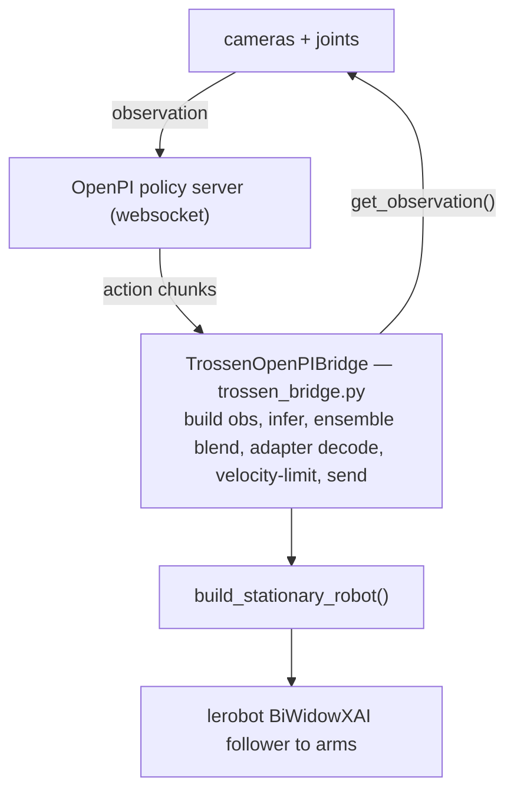
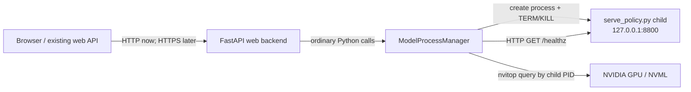
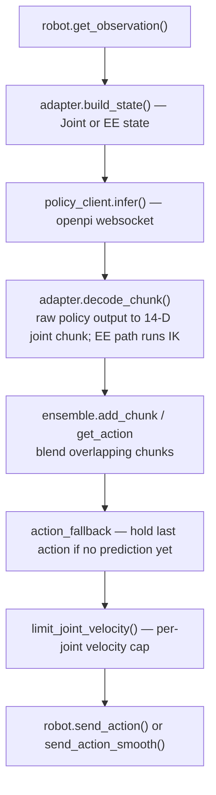
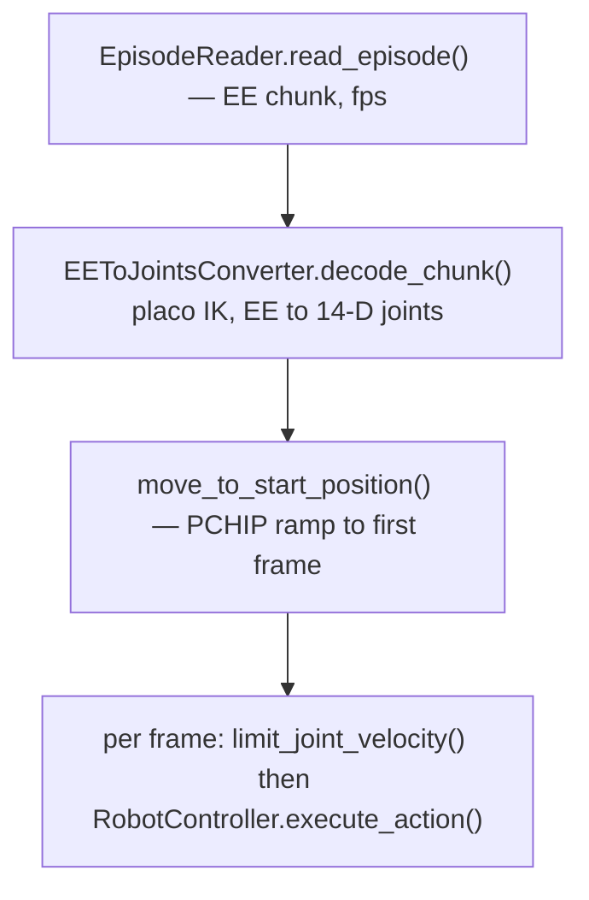

# Architecture

[← Docs home](README.md) · [Motion & Safety →](motion-safety.md)

## 1. The big picture

Two **control paths** share the same robot construction and motion/safety code:

- **Live** — policy server in the loop ([`TrossenOpenPIBridge`](../trossen_bridge.py)).
- **Replay** — a recorded dataset episode in the loop ([`dataset_replay.py`](../dataset_replay.py) + IK), using [`RobotController`](../robot_control.py).

Both are exposed through a CLI and through the [web app](../webapp/README.md).

### Machine A checkpoint-serving process

The web backend contains one `ModelProcessManager`; there is no separate manager
server or manager network protocol. The manager discovers checkpoints under
`/home/ibrahim/storage/VLA_MODELS` and owns one inference child process.

The inference child keeps the existing OpenPI WebSocket protocol. The manager
uses HTTP only for the child's local health check. `nvitop` is monitoring, not a
health or control protocol. A lifetime file lock allows only one manager for the
inference port, and the production systemd unit places the backend and child in
one cgroup for crash cleanup.

Only the checkpoint-serving half of the Machine A design is implemented here.
The later Laptop B gateway will carry observations/actions between Machine A and
the robot; the present live runner still expects robot hardware locally.

## 2. Data flow

### Live (policy)

### Replay (dataset)

See [Motion & Safety](motion-safety.md) for why the velocity limiter sits on both paths.

## 3. Module reference

### Control core (top level)
| Module | Role |
|---|---|
| [`robot_control.py`](../robot_control.py) | `build_stationary_robot()` (single source of the bimanual config + IPs/cameras), `RobotController` (joint-space motion, firmware-fault guard, sleep/start ramps), `send_action_smooth()` (feed-forward streaming), `limit_joint_velocity()` (velocity cap), `HOME_POSITION`. |
| [`trossen_bridge.py`](../trossen_bridge.py) | `TrossenOpenPIBridge`: the live policy loop — observation build, inference, ensemble, adapter decode, velocity limit, send, firmware guard. |
| [`adapters.py`](../adapters.py) | `ActionSpaceAdapter` interface + `JointAdapter` (raw 14-D joints) and `EEAdapter` (EE poses → IK → joints). Decouples action space from the loop. |
| [`ensemble/`](../ensemble/) | Action-chunk blending. `factory.make_ensemble("exp"\|"cogact"\|"none")` over a registry; `exponential.py` (recency weighting), `cogact.py` (consensus weighting), `base.py`/`config.py`. |
| [`async_worker.py`](../async_worker.py) | `AsyncPolicyWorker`: runs inference in a background thread for async mode. |
| [`action_fallback.py`](../action_fallback.py) | `HoldLastAction`: reuse the last action on steps with no fresh prediction. |
| [`action_logger.py`](../action_logger.py) | Per-episode action/overlap logging. |
| [`policy_connect.py`](../policy_connect.py) | `wait_for_policy_server()` — bounded, stop-aware TCP preflight so a down server fails cleanly instead of hanging. |

### End-effector / IK
| Module | Role |
|---|---|
| [`external/joint_to_ee/`](../external/joint_to_ee/) | EE ⇆ joints. `ee_to_joints.py` `EEToJointsConverter` (placo IK: EE poses → joints; FK for obs), `kinematics.py` (`make_kinematics`, URDF/placo setup), plus frame/orientation/representation helpers. |

### Dataset
| Module | Role |
|---|---|
| [`dataset_replay.py`](../dataset_replay.py) | `EpisodeReader` reads a LeRobot v3.0 dataset; `read_episode()` returns the `(N,16)` EE chunk (`left8 | right8`) and `fps`. |

### Web app (`webapp/`)
| Module | Role |
|---|---|
| [`server.py`](../webapp/server.py) | FastAPI app: serves the static UI, preset REST (`/api/presets`), `/api/files`, `/api/feedback`, `/api/episodes`, health, and the `/ws/telemetry` WebSocket; default runner factory; graceful shutdown. |
| [`session.py`](../webapp/session.py) | `SessionManager`: runs exactly one session on a daemon thread (builds the runner *on the thread* so stop/estop stay responsive); lock-protected; single-session guard. |
| [`model_process_manager.py`](../webapp/model_process_manager.py) | Discovers safe checkpoint IDs; owns, monitors, terminates, and reaps one local inference child; holds the exclusive manager lock; reports `/healthz` and nvitop GPU status. |
| [`model_api.py`](../webapp/model_api.py) | Checkpoint REST routes for discovery, status, start, and stop. Calls the in-process manager directly and prevents checkpoint changes during a robot session. |
| [`runners.py`](../webapp/runners.py) | `LiveRunner` / `ReplayRunner` adapting the bridge and replay tool to the run/stop/estop interface. Cheap `__init__`, all blocking work in `run()`. |
| [`movers.py`](../webapp/movers.py) | `SleepRunner` / `HomeRunner` — move the arm to a fixed pose, then disconnect (the Sleep/Home buttons). |
| [`telemetry.py`](../webapp/telemetry.py) | `TelemetrySink` interface + `NullSink`: the seam the control loop pushes events through (`on_action`, `on_images`, `on_inference`, `on_status`, `on_log`, …). |
| [`metrics.py`](../webapp/metrics.py) | Rolling RTT / loop-Hz / jitter / drop metrics computed from the event stream. |
| [`config_store.py`](../webapp/config_store.py) | Named config presets persisted as JSON. |
| [`feedback_store.py`](../webapp/feedback_store.py) | User feedback persisted as dated markdown (`/api/feedback`). |
| [`files_api.py`](../webapp/files_api.py) | Directory listing for the folder browser (`/api/files`), flags LeRobot datasets. |
| [`log_bridge.py`](../webapp/log_bridge.py) | Routes Python `logging` records into `TelemetrySink.on_log` so the browser log panel mirrors the terminal. |

### Frontend (`webapp/static/`)
Two pages — `index.html` (Live) and `replay.html` (Replay) — share `theme.css` and
ES modules under `static/js/` (`api`, `ws`, `config`, `charts`, `filebrowser`, `logs`,
`controls`, `feedback`, `live`, `replay`). Chart.js is **vendored** under
`static/vendor/` so the pages load with no internet. Layout details in the
[web app overview](../webapp/README.md).

### CLI entrypoint
All terminal commands live in one Typer app, [`cli.py`](../cli.py):

| Command | Role |
|---|---|
| `cli.py live-joint` | Live policy in **joint** space. |
| `cli.py live-ee` | Live policy in **end-effector** space (IK). |
| `cli.py replay` | Replay a dataset episode on the arm. |
| [`scripts/sleep.py`](../scripts/sleep.py) | Send the arm to the sleep pose (standalone script). |

## 4. Threading & lifecycle (web app)

`SessionManager.start()` spawns a daemon thread and **builds the runner on that
thread** — connecting to the policy server and the robot are blocking, so doing
them off the WebSocket event loop keeps `stop`/`estop` responsive. `stop()` flips a
flag honored by the connect-wait and the loops, then joins; access to the runner
and thread is lock-protected, and a join timeout is logged rather than hanging.
The single-session guard means Live, Replay, Sleep, and Home can never run at once.
Complete start/stop/estop operations are serialized so requests from multiple
WebSocket clients cannot replace one another's state. A separate lifecycle lock
serializes robot-session starts with checkpoint start/stop requests.

## 5. Testing

- **Off-robot suite** (`webapp/tests/`, `tests/`) runs in the `lerobot` conda env;
  hardware imports in `robot_control.py` are lazy so the module imports with just
  numpy/scipy. Run from `examples/trossen_ai` (a `conftest.py` puts it on `sys.path`).
- **Hardware-bound** code (`trossen_bridge.py`, live send path) is syntax/import
  checked; the parts that can run without hardware — `limit_joint_velocity`,
  `send_action_smooth`, the firmware guard, IK math — are unit-tested
  (`webapp/tests/test_motion_smooth.py`).
- See the [hardware runbook](../webapp/HARDWARE.md) for the on-rig checklist.
